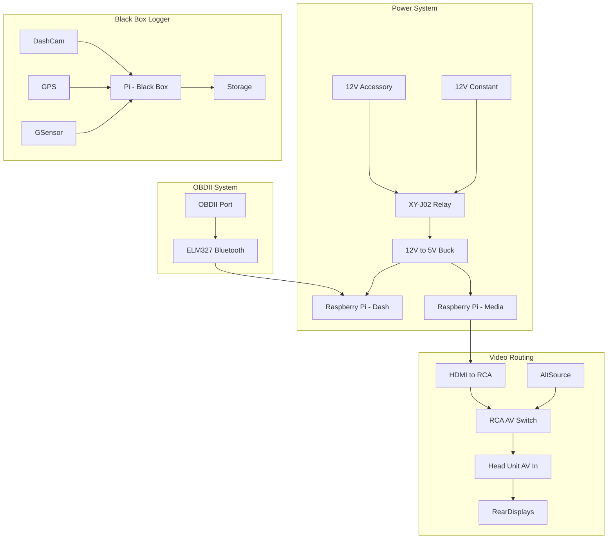

# 🧩 Wiring Overview

This folder contains all system-level wiring documentation for the DashForge platform. Each subsystem is described in its own Markdown file, including component lists, signal paths, power handling, GPIO logic, and behavior notes.

---

## 🗺️ High-Level System Overview

---

## 🧷 Subsystem Documentation

| Subsystem | Description | Link |
|----------|-------------|------|
| 🔌 [Power System](./wiring/power.md) | Handles 12V constant + ACC input, Pi power delivery, safe startup/shutdown |
| 🎥 [Video Routing](./wiring/video.md) | Connects Pi HDMI → RCA → AV switch → head unit → rear displays |
| 🎬 [Entertainment](./wiring/entertainment.md) | Media Pi playback path and display handling for rear passengers |
| 📈 [OBDII](./wiring/obdii.md) | Connects Pi to vehicle OBDII port using ELM327 Bluetooth adapter |
| ⏻ [Shutdown Logic](./wiring/shutdown.md) | Detects ACC drop and triggers GPIO-based Pi shutdown before power-off |
| 🌐 [Networking](./wiring/network.md) *(planned)* | Future design for Pi-to-Pi LAN communication and microcontroller integration |
| 📹 [Black Box Logger](./wiring/blackbox.md) *(planned)* | Records video, GPS, and vehicle telemetry in case of crash or event |

---

## 📝 Notes

- Each wiring document contains its own diagram, wiring table, behavior, and parts list.
- The overview diagram above is intended to visualize system interactions, not pin-level connections.
- These documents are living references and will evolve as hardware is added.

# 📦 DashForge Parts Inventory

This document lists all parts used or intended for use in the DashForge in-vehicle Raspberry Pi system. All Amazon product links are included for reference.

---

## 🚗 Vehicle & Head Unit

| Item | Description | Link |
|------|-------------|------|
| 2005 Chevy Avalanche | Project vehicle | N/A |
| Hieha Car Stereo | 7" touchscreen head unit with RCA AV input/output | [Link](https://www.amazon.com/dp/B08QMZ4TGF?ref=ppx_yo2ov_dt_b_fed_asin_title) |
| SWICP2 | CAN-Bus Steering Wheel Control Interface | [Link](https://www.amazon.com/dp/B01KX8QWAU?ref=ppx_yo2ov_dt_b_fed_asin_title) |

---

## 🎛️ Power Management

| Item | Description | Link |
|------|-------------|------|
| KeeYees XY-J02 Relay Module (Qty: 2) | Programmable delay-off relay | [Link](https://www.amazon.com/gp/product/B0C8CM6GQF/ref=ppx_yo_dt_b_asin_title_o01_s00?ie=UTF8&th=1) |
| 12V Mini Rocker Switch (Qty: 6) | For inline kill switch | [Link](https://www.amazon.com/gp/product/B07L9JWVVR/ref=ppx_yo_dt_b_asin_title_o00_s00?ie=UTF8&psc=1) |
| 12V to 5V Buck Converter | Pi power supply | [Link](https://www.amazon.com/dp/B01MQ1M4C0?ref_=ppx_hzsearch_conn_dt_b_fed_asin_title_6) |
| Add-a-Circuit Fuse Tap Adapter | Pull 12V constant and ACC from fuse panel | [Link](https://www.amazon.com/dp/B0812DGR5Q?ref_=ppx_hzsearch_conn_dt_b_fed_asin_title_4&th=1) |
| PC817 2-Channel Optocoupler Isolation Module | Isolates 12V automotive signal and safe lower and reliable 3.3V / 5V | [Link](https://www.amazon.com/dp/B0DD3D3H3H?psc=1&ref=ppx_yo2ov_dt_b_product_details) |

---

## 📡 OBDII & Diagnostics

| Item | Description | Link |
|------|-------------|------|
| ELM327 OBDII Bluetooth Adapter | Communicates with Torque/Pi | [Link](https://www.amazon.com/dp/B01MAURDGG?ref_=ppx_hzsearch_conn_dt_b_fed_asin_title_1) |
| Torque Pro (Android) | Paid app for OBDII diagnostics | N/A |

---

## 💻 Raspberry Pi & Adapters

| Item | Description | Link |
|------|-------------|------|
| Raspberry Pi 3 B+ | Main Pi for dash/media | [Link](https://www.amazon.com/dp/B07BDR5PDW?ref_=ppx_hzsearch_conn_dt_b_fed_asin_title_4) |
| Raspberry Pi Zero W | Alternate low-power Pi | (same link as above Pi bundle) |
| Mini HDMI Adapter | For Pi Zero video out | [Link](https://www.amazon.com/dp/B0BBTVQMMS?ref=ppx_yo2ov_dt_b_fed_asin_title&th=1) |
| Micro USB to USB Adapter | For connecting USB to Pi Zero | [Link](https://www.amazon.com/dp/B00K4RZQWQ?ref=ppx_yo2ov_dt_b_fed_asin_title&th=1) |

---

## 🖥️ Displays & Video Routing

| Item | Description | Link |
|------|-------------|------|
| HDMI to RCA Converter | For head unit video input | [Link](https://www.amazon.com/dp/B082X97KKW?ref=ppx_yo2ov_dt_b_fed_asin_title) |
| RCA 3-Way AV Splitter | Switch between video sources | [Link](https://www.amazon.com/dp/B0DM58HDYQ?ref=ppx_yo2ov_dt_b_fed_asin_title) |
| USB+HDMI Dash Mount Extension | Expose USB and HDMI ports in vehicle cabin | [Link](https://www.amazon.com/dp/B07T4VTT4T?ref_=ppx_hzsearch_conn_dt_b_fed_asin_title_3) |
| RCA-compatible Displays | 9–12V powered backup displays | (in inventory) |
| Portable DVD Player | Alternate display/input | N/A |

---

## 🌐 Networking

| Item | Description | Link |
|------|-------------|------|
| Micro USB 5-Port 10/100Mbps Switch | For Pi-to-Pi wired communication | [Link](https://www.amazon.com/dp/B06XQSW7Z6?ref_=ppx_hzsearch_conn_dt_b_fed_asin_title_12) |

---

## 🧠 Embedded Components & Dev Tools

| Item | Description | Link |
|------|-------------|------|
| OLED I2C Displays (Qty: Multiple) | For simple info displays | [Link](https://www.amazon.com/dp/B01N0KIXJ6?ref_=ppx_hzsearch_conn_dt_b_fed_asin_title_9&th=1) |
| Arduino Nano/UNO (Mixed) | For basic microcontroller tasks | [Link](https://www.amazon.com/dp/B07RS911JD?ref_=ppx_hzsearch_conn_dt_b_fed_asin_title_3), [Link](https://www.amazon.com/dp/B07KC9C6H5?ref_=ppx_hzsearch_conn_dt_b_fed_asin_title_5) |
| ESP32 Dev Boards | Wi-Fi connected devices | [Link](https://www.amazon.com/dp/B08D5ZD528?ref_=ppx_hzsearch_conn_dt_b_fed_asin_title_4&th=1) |
| 5V Relays | For switching various loads | (in inventory) |
| 12V to 5V / 3.3V Modules | Regulated logic power for sensors | (in inventory) |

---

## 📥 To Purchase Later

| Item | Purpose |
|------|---------|
| Dash/Rear Pi Camera | For black box dash cam |
| Pi-compatible GPS Module | For logging and geo-stamped diagnostics |
| Battery voltage monitor (or INA219) | For power monitoring and logging |
| 12V-to-12V Isolated Supply (for cameras) | Noise-free camera power |
| Weatherproof case for Pi(s) | Vehicle-safe enclosure |
| Small USB audio DAC | To improve sound if needed for media Pi |
