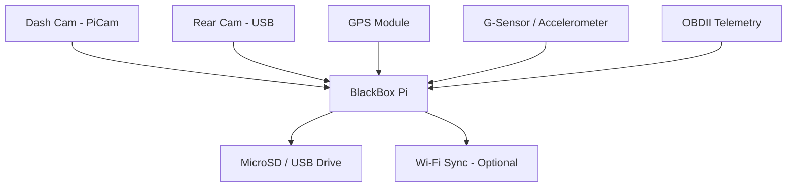

# 📹 Black Box Logger & Camera System (Planned)

This document outlines the planned implementation of a Black Box recording system in the vehicle. The goal is to continuously monitor and log key vehicle activity — including video footage, diagnostics, power state, and sensor data — and securely archive it for later review, especially in the event of a crash or system event.

---

## Purpose

The Black Box system will:

- Continuously or conditionally record dash and/or rear video footage
- Log critical vehicle telemetry (e.g., speed, RPM, brake status, GPS)
- Timestamp and synchronize logs across data sources
- Automatically archive recent events when ignition is cut or crash detected
- Function independently from media or dashboard Pis

---

## Components (Planned)

- Raspberry Pi Zero W or 3A+ (dedicated to logging)
- Raspberry Pi Camera Module (Dash)
- Optional USB Backup/Rear Cam
- MicroSD card for video/data storage
- External GPS module (USB or UART)
- Accelerometer or G-Sensor (I2C or analog)
- Optional: Wi-Fi sync to another Pi or offload device
- Constant 12V power + shutdown delay via XY-J02
- File locking to prevent corruption during power loss

---

## System Diagram

---

## Wiring Table (Example)

| Purpose                        | Connection         | From                     | To                     |
|--------------------------------|--------------------|--------------------------|------------------------|
| Capture front video            | CSI                | Pi Camera                | Raspberry Pi           |
| Capture rear video             | USB                | USB Backup Cam           | Raspberry Pi           |
| Location logging               | USB/UART           | GPS Receiver             | Raspberry Pi           |
| Crash detection                | I2C / Analog       | Accelerometer/G-Sensor   | Raspberry Pi           |
| Vehicle data logging           | Bluetooth / Serial | ELM327 OBDII Adapter     | Raspberry Pi           |
| Power input                    | 12V Constant       | Fuse Box via Relay       | Buck Converter to Pi   |
| Safe shutdown                  | GPIO & XY-J02      | Accessory Power Signal   | Pi GPIO + Relay Module |

---

## Behavior (Planned)

- The BlackBox Pi boots when ignition is turned on.
- It continuously logs:
  - Dash camera footage (rotating buffer)
  - Rear camera (if installed)
  - GPS position
  - OBDII data (speed, RPM, throttle, etc.)
  - G-sensor readings (shock, tilt, movement)
- When ignition is turned off or a shock is detected:
  - Footage and logs from the last X minutes are locked and archived
  - The Pi shuts down safely via delay-off relay
- Optionally, archived logs can sync to another Pi or cloud once Wi-Fi becomes available.

---

## Storage Strategy

- Use a dedicated partition or USB drive for logs
- Store rotating video files (e.g., 1-minute segments)
- Maintain a persistent event log with timestamps
- Implement watchdog to prevent file corruption
- Optional: auto-upload over Wi-Fi hotspot

---

## Future Expansion

- Add tamper-resistant power supply (diode isolation, capacitors)
- Encrypt log files for data integrity
- Use MQTT to push alerts to dash or mobile device
- Detect impact via G-sensor or sudden voltage drop
- Monitor vehicle battery and voltage trends over time

---

## 🔗 Parts List (Planned)

| Part | Description | Purchase Link |
|------|-------------|----------------|
| Raspberry Pi (3A+ or Zero W) | Dedicated Black Box logger | TBD |
| Raspberry Pi Camera | Dash-facing video input | TBD |
| USB Rear Cam | Optional rear-facing capture | TBD |
| GPS Module (USB/UART) | Location tracking | TBD |
| G-Sensor / Accelerometer | Shock/crash detection | TBD |
| MicroSD or USB Storage | Local log and video storage | N/A |
| XY-J02 Delay-Off Relay | Safe shutdown delay controller | [View on Amazon](https://www.amazon.com/gp/product/B0C8CM6GQF/ref=ppx_yo_dt_b_asin_title_o01_s00?ie=UTF8&th=1) |

---

## Notes

- This will be powered separately from media or dash Pis.
- Logging Pi should operate headless, auto-starting on boot.
- Data format should be consistent and exportable (e.g., JSON + MP4).
- Test real-world write performance and temperature in-vehicle.
