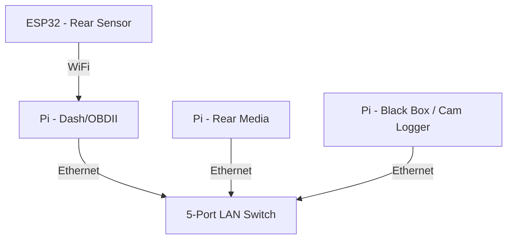

# 🌐 Networking (Planned)

This document outlines a planned wired/wireless network architecture to support communication between multiple Raspberry Pi devices, microcontrollers, and external modules. This is not part of the initial install but is documented here for future integration.

---

## Purpose

A local network enables:

- Communication between dashboard, media, and black box Pi devices
- Shared access to sensors or logging tools (e.g., GPS, cameras)
- Communication with microcontrollers over MQTT or serial bridges
- File sharing, OTA updates, or remote access over a local interface

---

## Components (Planned)

- USB-powered 5-port 10/100Mbps switch
- Raspberry Pi 3B+ or Zero devices with Ethernet or USB-Ethernet adapters
- ESP32s (communicate over Wi-Fi or serial)
- Micro USB power cable (for LAN switch)

---

## Communication Diagram (Example)

---

## Wiring Table (Example)

| Purpose                       | Connection        | From               | To                      |
|-------------------------------|-------------------|--------------------|--------------------------|
| Local Ethernet communication | RJ45              | Pi 1 (Dash)        | LAN Switch               |
| Local Ethernet communication | RJ45              | Pi 2 (Media)       | LAN Switch               |
| Local Ethernet communication | RJ45              | Pi 3 (Black Box)   | LAN Switch               |
| Power for LAN switch         | USB power         | Pi 1 or 12V source | LAN Switch               |
| Sensor communication         | Wi-Fi             | ESP32              | Pi 1 or Pi 3             |

---

## Behavior (Planned)

- A USB-powered switch distributes wired Ethernet between all Pi units.
- ESP32 devices connect via Wi-Fi (using Pi-hosted AP or local router).
- Raspberry Pis can share files, publish/subscribe to MQTT, or sync logs between devices.
- Potential for a lightweight headless dashboard API server and media node.

---

## Future Expansion Ideas

- MQTT broker on Pi 1 to handle alerts from ESP32 microcontroller nodes.
- Internal Wi-Fi AP for mobile/tablet access inside the vehicle.
- Host an internal web UI for diagnostics, logs, and control.
- Remote SSH/VNC access when on local hotspot.

---

## 🔗 Parts List

| Part | Description | Amazon Link |
|------|-------------|-------------|
| Micro-USB 5-Port LAN Switch | USB-powered local Ethernet switch | [View on Amazon](https://www.amazon.com/dp/B06XQSW7Z6?ref_=ppx_hzsearch_conn_dt_b_fed_asin_title_12) |

