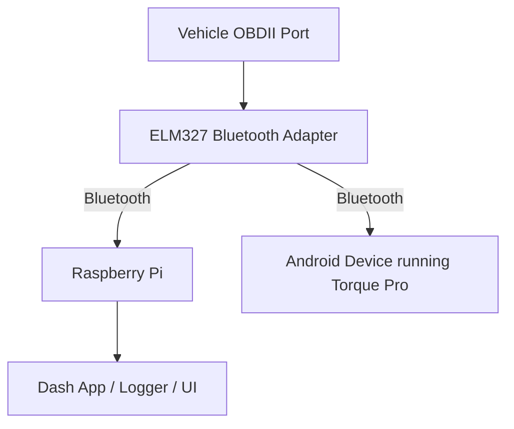

# 📈 OBDII Interface Wiring

This document outlines the connection between the vehicle’s OBDII port and the Raspberry Pi using a Bluetooth ELM327 adapter for real-time diagnostics.

---

## Components

- ELM327 OBDII Bluetooth Adapter
- OBDII Port (in-vehicle)
- Raspberry Pi 3B+ (with onboard Bluetooth)
- Torque Pro (Android, optional)
- Python/Node.js-based diagnostic app (future)

---

## Communication Flow Diagram

---

## Wiring Table

| Purpose                          | Connection           | From               | To                    |
|----------------------------------|----------------------|--------------------|------------------------|
| Vehicle diagnostic data access   | OBDII                | Vehicle OBD Port   | ELM327 Bluetooth       |
| Wireless connection              | Bluetooth pairing    | ELM327 Adapter     | Raspberry Pi           |
| Wireless connection              | Bluetooth pairing    | ELM327 Adapter     | Torque Pro on Android  |
| Data polling / dashboard display| Software / Scripts   | Raspberry Pi       | Custom Dash App / UI   |

---

## Behavior

- The ELM327 adapter plugs into the OBDII port and remains powered while the vehicle is on.
- The Raspberry Pi connects to the ELM327 over Bluetooth (serial profile).
- Data such as RPM, engine load, fuel level, temperature, etc., is read using libraries like `python-OBD`.
- The Pi can display this data in real time or log it for future use.
- Optionally, Torque Pro on Android can pair with the same ELM327 adapter for mobile diagnostics.

---

## Software Tools (Planned or Available)

- [`python-OBD`](https://github.com/brendan-w/python-OBD): Python library for real-time OBDII data polling.
- `pyserial`: Serial communication with ELM327 over Bluetooth.
- Node.js option: Use `obd-parser` or similar packages for JS dashboards.
- `Torque Pro`: Mobile diagnostic viewer (already owned).

---

## Notes

- ELM327 stays powered while plugged in — monitor for parasitic draw.
- Ensure the Pi's Bluetooth is enabled and scanning (`bluetoothctl` or GUI tools).
- Most ELM327s appear as `/dev/rfcomm0` once paired.
- Use a cron job or systemd service to auto-connect and start polling on boot.

---

## 🔗 Parts List

| Part | Description | Amazon Link |
|------|-------------|-------------|
| ELM327 Bluetooth OBDII Adapter | Communicates engine data to Raspberry Pi | [View on Amazon](https://www.amazon.com/dp/B01MAURDGG?ref_=ppx_hzsearch_conn_dt_b_fed_asin_title_1) |

