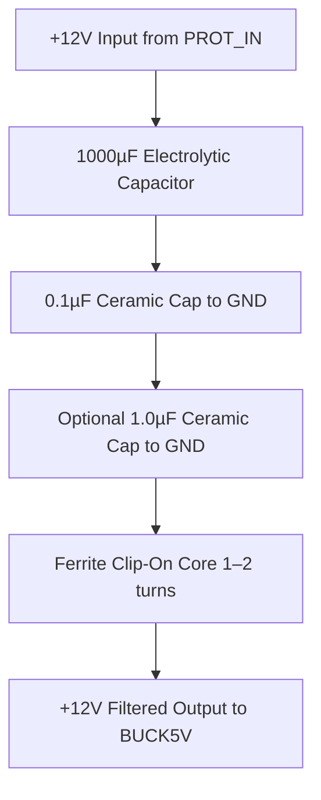

# 🔧 Power Filtering

## ✅ Purpose

Filtering helps smooth out **noise, ripple, and transients** from the 12V input that make it past the protection stage. In automotive environments, power can be **dirty**, with:

- 🌀 Alternator whine
- 🔺 Ignition noise
- ⚡ Switching noise from relays or other electronics

Filtering cleans the power before it reaches your voltage regulator (buck converter), improving performance and preventing random reboots or weird behavior on sensitive devices like the Raspberry Pi.

---

## 🧰 Recommended Components

| Purpose                | Component             | Minimum Spec                       | Recommended                          |
|------------------------|-----------------------|------------------------------------|--------------------------------------|
| Bulk Decoupling        | Electrolytic Capacitor | 470µF, 25V                         | 1000µF, 25V (low ESR if possible)     |
| High-Frequency Filtering | Ceramic Capacitor     | 0.1µF                              | 0.1µF + 1µF in parallel (X7R type)    |
| Noise Suppression      | Ferrite Bead / Inductor | 100µH                             | 100µH – 220µH Common Mode Choke or Ferrite Ring |
| Optional               | LC Filter             | As needed                          | L: 100µH + C: 470µF–1000µF           |

> ⚠️ Make sure your caps are rated for at least 25V (automotive spikes can be high).

---


## ⚠️ Wiring Notes

1. **Capacitor Placement Matters**  
   - Place **ceramics as close as possible** to the **input of your buck converter**.
   - Electrolytics can be a little further back, but still inline before conversion.

2. **Ferrite Core Looping**  
   - For your **clip-on ferrite**, loop the power wire **through it 1–2 times** to increase suppression.
   - Clip it **after the caps**, just before the regulator input.

3. **Ground Connections**  
   - Tie all cap grounds to a **solid, low-impedance ground plane** or bus.
   - Avoid long, thin traces for ground — especially for the ceramics.

4. **Trace Width for Power**  
   - Make sure your traces to and from this module can handle **3A continuous** — at least **50 mil (1.27mm)** if using 1oz copper, preferably more.

---

### 🧭 Mermaid Diagram



---

## 📊 ASCII Wiring Diagram

```
 +12V IN (from PROT_IN)
        |
    [ 1000 µF Electrolytic ]
        |
    [ 0.1 µF Ceramic ] ─┬─ GND
        |               |
    [ 1.0 µF Ceramic ]  ┘ (optional)
        |
(Through Ferrite Snap-On Core)
        |
   +12V Filtered Out → To BUCK5V

```

