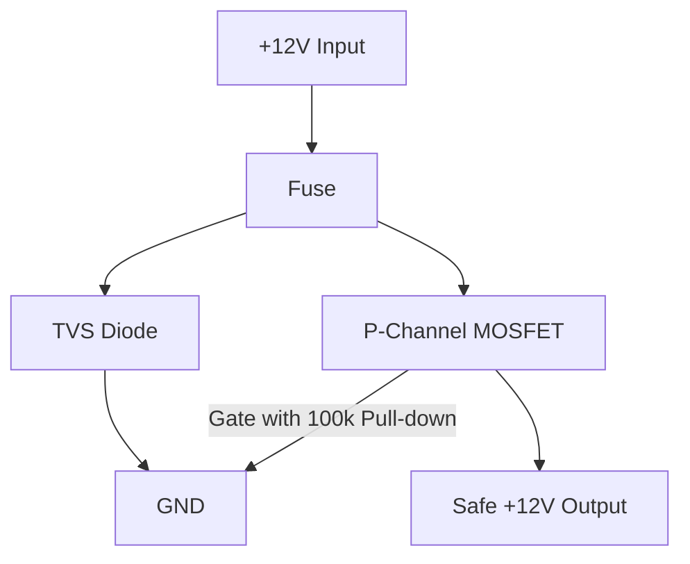

---

### 📘 Quick Summary of Input Protection


# 🔧 Input Protection Module

## ✅ Purpose

This module is your *first line of defense* when working in a 12V automotive environment. It protects sensitive electronics from destructive power events common in cars — reverse polarity, voltage spikes, and current surges. It ensures that only clean, correctly-polarized voltage enters your circuit. 

- **Reverse Polarity** (accidental wiring or jumpstarts)
- **Voltage Spikes / Transients** (e.g., load dumps, inductive kicks)
- **Current Surges / Short Circuits** (bad things happening on the other end)
- **Modular Use** (Makes a great reusable power input board to drop into any automotive project)


---

## 📦 Suggested Setup

| Component               | Type                        | Minimum Spec                     | Recommended Part                        |
|------------------------|-----------------------------|----------------------------------|-----------------------------------------|
| Reverse Polarity       | P-Channel MOSFET            | Vds ≥ 30V, Id ≥ 5A, low Rds(on)  | **IRF4905**, **IRF9540N**, **FQP27P06** |
| Gate Resistor (optional) | Resistor                   | 10kΩ                             | 10kΩ                                    |
| Pull-down Resistor     | Resistor                    | 100kΩ                            | 100kΩ (to keep gate from floating)      |
| TVS Diode              | Transient Protection        | 18V Clamp                        | **P6KE18A**, **1.5KE18A**, **SMBJ18A**  |
| Fuse                   | Blade or inline             | 3A–5A                            | 5A fuse (resettable or inline blade)    |

---

## 🧰 Selected Components

| Purpose              | Component Type         | Selected Part                              | Notes                                                   |
|----------------------|------------------------|---------------------------------------------|----------------------------------------------------------|
| Reverse Polarity     | P-Channel MOSFET       | [IRF4905 (Amazon Pack)](https://www.amazon.com/dp/B0CBKJD2L9/) | Low Rds(on), suitable for 12V applications               |
| Transient Protection | TVS Diode              | [1.5KE18A (Amazon)](https://www.amazon.com/dp/B079KKMC5Z/)     | 18V clamping, bi-directional, protects against spikes    |
| Gate Resistor        | Resistor               | 100kΩ                                        | Pull-down to keep MOSFET gate from floating             |
| Inline Fuse          | Blade or Inline Fuse   | [4A Fast Blow Glass Fuse](https://www.amazon.com/dp/B0813Q4S6P?ref=ppx_yo2ov_dt_b_fed_asin_title)                                | Protects from overcurrent conditions                     |

---

## 🧮 Wiring Notes

- **MOSFET is installed "high-side"** (source to input, drain to output).
- When 12V is applied correctly, gate is pulled lower than source and MOSFET conducts.
- **TVS diode is across input and GND** to clamp transients.
- A **100kΩ pull-down** on the gate ensures clean turn-on behavior.
- **Fuse is first in line** to cut power on shorts or high draw.

---

### 🔌 Wiring Diagram (Mermaid)



*Gate control is passive — when VIN is high, Gate is pulled low and the MOSFET conducts.*

---

## 📊 ASCII Wiring Diagram

```
     +12V IN
        |
     [Fuse] --+------------------------+
              |                        |
          [TVS Diode]                 |
           (1.5KE18A)                 |
              |                      [P-Channel MOSFET]
             GND                  Source | Drain
                                        |   
                                     +12V Out --> to Regulator Input or Next Stage
                                        |
                                    [Gate]
                                       |
                                 [100kΩ Pull-down]
                                       |
                                      GND
```

---

### 🧩 Modular Use

This input protection module can be reused across any embedded or automotive-style power supply project. Just solder it up as a self-contained board and feed 12V in — safe, protected voltage comes out.
