# 🔌 Power System Wiring

This wiring plan outlines a flexible and expandable **Smart Automotive Power Hub** designed to safely manage power and signaling for Raspberry Pi and other in-vehicle electronics.

The system is built around:
- **12V Constant and Accessory power** from the vehicle
- A **delay-off relay** for clean shutdowns
- One or more **buck converters** to supply regulated 5V power
- **Opto-isolated signal outputs** for GPIO-safe device shutdown triggers
- Optional **reference voltage inputs** (3.3V or 5V) to match logic levels
- Modular **screw terminals** for clean, expandable connections

While originally designed to safely power a Raspberry Pi, this system can now serve multiple devices with coordinated startup/shutdown logic — making it ideal for in-car dashboards, black boxes, cameras, microcontrollers, and future modules.

---

## 🔧 Components

### 🔌 Core Power Control
- **KeeYees XY-J02 Delay-Off Relay Module** – Delays power-off after ACC turns off, allowing safe shutdown
- **12V Constant Power (fused)** – Always-on power source from vehicle
- **12V Accessory Power (fused)** – Switched power from ignition/ACC circuit
- **12V Mini Rocker Switch** – Inline kill switch to disable system manually
- **Add-a-Circuit Fuse Tap Adapter** – Safely taps into vehicle fuse box for ACC and Constant power

### ⚡ Voltage Regulation
- **12V to 5V 3A Buck Converter** – Provides regulated 5V for Raspberry Pi (or similar devices)
- *(Optional Upgrade)* **High-Current 5V Buck Converter (e.g. 5–10A)** – Supports multiple devices or high-draw loads

### 🧠 Signaling & Logic
- **PC817 2-Channel Optocoupler Isolation Module** – Converts 12V ACC to safe GPIO-level shutdown signals
- **Logic Reference Rail (3.3V / 5V Input)** – Supplied from connected devices to define signal output levels

### 🧩 Primary Device (Current Use Case)
- **Raspberry Pi 3B+** – Main computing device powered and monitored by this system

### 🪛 Integration & Expansion
- **Screw Terminal Blocks** – Modular outputs for connecting additional devices (power + signal)
- *(Optional)* **Inline Mini Blade Fuses or Breakers** – Protect each powered device output


---

## Power Flow Diagram 

### 📥 Inputs (to Power Hub)

| Label        | Description                              |
|--------------|------------------------------------------|
| `VIN_CONST`  | 12V Constant (fused from battery/fuse box) |
| `VIN_ACC`    | 12V Accessory/Ignition (fused)           |
| `VREF_3V3`   | 3.3V reference from Pi or other device   |
| `VREF_5V`    | 5V reference from second device (optional) |
| `GND_IN`     | Shared ground from vehicle chassis       |

---

### 📤 Outputs (from Power Hub)

| Label         | Description                              |
|---------------|------------------------------------------|
| `VOUT_12V_SW` | 12V Switched output (on with ignition + delay) |
| `VOUT_5V`     | 5V regulated output (Buck Converter)     |
| `SIG_SHUT_3V3`| GPIO shutdown signal (3.3V logic)        |
| `SIG_SHUT_5V` | GPIO shutdown signal (5V logic)          |
| `GND_OUT`     | Shared ground to all devices             |

### 🧩 Internal Components and Labels

| Label    | Component                        | Notes |
|----------|----------------------------------|-------|
| `XYJ02`  | XY-J02 Delay-Off Relay Module    | Controls switching of 12V Constant to Buck Converter |
| `BUCK5V` | 12V to 5V Buck Converter (3A)     | Converts relay output to Pi-safe power |
| `OPTO3V3`| PC817 Optocoupler (for Pi GPIO17) | Pulls signal LOW on ACC OFF, uses Pi 3.3V rail |
| `OPTO5V` | PC817 Optocoupler (for other 5V device) | Same concept, uses 5V rail |
| `FUSE_X` | Fuses (Glass or ATO/ATC)          | Placed on VIN_CONST input and all powered outputs |
| `SW_KILL`| Inline Rocker Switch             | Master kill on VIN_CONST line |
| `PROT_IN`  | Input Protection Module (MOSFET + TVS + Fuse) | Handles reverse polarity, surges, and overcurrent |


### 🧯 Ground Wiring Notes

All components share a common ground. Use a **GND bus bar or terminal block** inside the enclosure to tie together:

- VIN_CONST ground
- VIN_ACC ground
- XY-J02 ground
- Buck converter ground
- Raspberry Pi ground
- Optocoupler emitter sides
- Output grounds

All device outputs (Pi, other device, etc.) should tie into this common ground.

---

### 🛡️ PROT_IN (Input Protection Module)

Protects downstream components from reverse polarity, voltage spikes, and overcurrent.  
See [Input Protection Module](./power-input-protection.md) for full details and wiring.

---

### 🧠 Pull-up Wiring for Optocouplers (ASCII Illustration)

For each shutdown signal, wire like this using the device's own logic rail:

    Device 3.3V or 5V ─────┐
                          [10kΩ]
                            │
    Opto Collector ─────────┼───── GPIO Pin
                            │
                      Device GND

- The **resistor pulls the signal HIGH** when the optocoupler is not conducting
- When accessory power is cut, the opto **pulls the GPIO LOW**, triggering shutdown
- Use the **same voltage rail and ground** from the device receiving the signal

---

## Sequence Diagram

```mermaid
sequenceDiagram
    participant ACC as Accessory Power (VIN_ACC)
    participant PowerHub as Smart Power Hub
    participant TargetDevice as Target Device (Pi or Other)
    
    ACC->>PowerHub: ACC Power ON
    PowerHub->>TargetDevice: Relay Closes → Power ON
    Note over TargetDevice: Normal Operation (Booted)
    
    ACC-->>PowerHub: ACC Power OFF
    ACC-->>TargetDevice: GPIO Input goes LOW (via Optocoupler)
    TargetDevice->>TargetDevice: Shutdown Script Triggers
    TargetDevice->>PowerHub: Shutdown in progress...
    Note over PowerHub: Delay Countdown (~30–60 sec)
    PowerHub-->>TargetDevice: Power Cut (relay opens)
```



---

## ⚙️ Behavior Summary

- When the vehicle turns ON (ACC = 12V):
  - The Smart Power Hub detects accessory power via VIN_ACC
  - The XY-J02 relay activates, passing 12V Constant through a fuse and buck converter
  - The connected device(s) power on via VOUT_5V or VOUT_12V_SW

- While the vehicle is running:
  - GPIO shutdown lines (e.g., SIG_SHUT_3V3, SIG_SHUT_5V) remain HIGH via opto-isolated pull-up
  - Devices operate normally

- When the vehicle turns OFF (ACC = 0V):
  - The XY-J02 relay begins its delay timer (e.g., 30–60 seconds)
  - The optocoupler detects loss of VIN_ACC and pulls the shutdown signal LOW
  - Devices detect the falling edge and begin clean shutdown
  - After the delay, power is cut via the relay

- The inline rocker switch (SW_KILL) can manually disconnect VIN_CONST, disabling the system entirely

> 🔄 This flow ensures a clean, timed shutdown without corrupting storage or requiring additional power logic in each connected device.

---

## Shutdown Script (Python Example)

```python
# shutdown_trigger.py
import RPi.GPIO as GPIO
import os
import time

SHUTDOWN_PIN = 17

GPIO.setmode(GPIO.BCM)
GPIO.setup(SHUTDOWN_PIN, GPIO.IN, pull_up_down=GPIO.PUD_UP)

try:
    GPIO.wait_for_edge(SHUTDOWN_PIN, GPIO.FALLING)
    os.system("sudo shutdown -h now")
except:
    pass
finally:
    GPIO.cleanup()
```

- Run at boot using `rc.local`, `cron`, or a `systemd` service.

---

## 📝 Notes

- Always fuse both `VIN_CONST` and `VIN_ACC` inputs for safety
- Recommended delay for the XY-J02 is **30–60 seconds** to ensure clean shutdown
- Ensure the buck converter is rated for **at least 3A** to power the Pi and peripherals
- Simulate ACC loss during testing to verify full shutdown timing and GPIO behavior
- Use **optocouplers** for reliable and isolated GPIO signal detection (recommended over pull-up/down resistors alone)
- Optional: log shutdown events or power transitions for diagnostics and reliability tracking

---

## 🔗 Parts List

| Part | Description | Amazon Link |
|------|-------------|-------------|
| XY-J02 Delay-Off Relay Module | Delays power-off after ACC turns off (controls VOUT_12V_SW and BUCK5V) | [View on Amazon](https://www.amazon.com/gp/product/B0C8CM6GQF/ref=ppx_yo_dt_b_asin_title_o01_s00?ie=UTF8&th=1) |
| 12V Mini Rocker Switch | Master kill switch for VIN_CONST line | [View on Amazon](https://www.amazon.com/gp/product/B07L9JWVVR/ref=ppx_yo_dt_b_asin_title_o00_s00?ie=UTF8&psc=1) |
| 12V to 5V Buck Converter (3A) | Regulates 12V Switched to safe 5V power for Raspberry Pi | [View on Amazon](https://www.amazon.com/dp/B01MQ1M4C0?ref_=ppx_hzsearch_conn_dt_b_fed_asin_title_6) |
| Add-a-Circuit Fuse Tap Adapter | Safely taps 12V Constant and Accessory from fuse box | [View on Amazon](https://www.amazon.com/dp/B0812DGR5Q?ref_=ppx_hzsearch_conn_dt_b_fed_asin_title_4&th=1) |
| PC817 2-Channel Optocoupler Isolation Module | Opto-isolated 12V accessory sensing, outputs safe 3.3V/5V GPIO signals | [View on Amazon](https://www.amazon.com/dp/B0DD3D3H3H?psc=1&ref=ppx_yo2ov_dt_b_product_details) |

> 🛠️ You’ll also need wiring, connectors, and a common ground solution (bus bar or terminal strip).

