# 🔌 Power System Wiring

Wiring plan for safe Raspberry Pi power-up and shutdown using a delay-off relay, constant and accessory 12V sources, a buck converter, and an inline kill switch.

---

## Components

- KeeYees XY-J02 Delay-Off Relay Module
- 12V Constant power (fused)
- 12V Accessory power (fused)
- 12V Mini Rocker Switch
- 12V to 5V 3A Buck Converter
- Raspberry Pi 3B+ (primary)
- Add-a-Circuit Fuse Tap Adapter

---

## Power Flow Diagram


---

## Sequence Diagram

```mermaid
sequenceDiagram
    participant ACC as Accessory Power
    participant XYJ02 as XY-J02 Relay
    participant Pi as Raspberry Pi
    ACC->>XYJ02: ACC Power ON
    XYJ02->>Pi: Relay Closes → Pi Powers ON
    Note over Pi: Normal Operation
    ACC-->>XYJ02: ACC Power OFF
    XYJ02->>Pi: GPIO Input goes LOW
    Pi->>Pi: Shutdown Script Triggers
    Pi->>XYJ02: Shutdown in progress...
    Note over XYJ02: Delay Countdown (~30–60 sec)
    XYJ02-->>Pi: Power Cut (relay opens)
```



---

## Wiring Table (General Power)

| Wire | From | To |
|------|------|----|
| 12V Constant | Fuse tap | Inline rocker switch input |
| Rocker switch output | | XY-J02 VCC |
| 12V Accessory | Fuse tap | XY-J02 Trigger |
| Ground | Vehicle chassis | XY-J02 GND and Buck GND |
| XY-J02 Relay COM | 12V Constant | |
| XY-J02 Relay NO | Buck Converter IN+ | |
| Buck OUT+ | | Pi 5V input (GPIO or USB-C via adapter) |
| Buck GND | | Pi GND |

---

## Wiring Table (Shutdown Sequence)

| Purpose                         | Connection     | From                    | To                  |
|----------------------------------|----------------|-------------------------|---------------------|
| Relay trigger signal            | 12V ACC        | Vehicle Fuse Box        | XY-J02 Trigger Pin  |
| Primary Pi power source         | Relay COM/NO   | 12V Constant → Buck     | Raspberry Pi 5V IN  |
| GPIO shutdown signal            | 5V Relay Logic | Relay NC → GPIO17       | Raspberry Pi GPIO17 |
| Shared ground                   | Ground         | Vehicle Chassis         | XY-J02 & Pi GND     |

> Optional: connect relay output (NO) to GPIO17 via pull-up/pull-down or opto-isolated circuit for signal integrity.

---

## Behavior

- When ignition is ON (ACC = 12V), XY-J02 relay closes and provides power to the Pi.
- When ignition is turned OFF, the XY-J02 begins a programmable delay.
- After the delay, the relay opens and power to the Pi is cut.
- The Pi should monitor a GPIO pin connected to ACC (or another GPIO relay circuit) to trigger safe shutdown before power is cut.
- The inline rocker switch allows full manual shutdown by cutting 12V Constant to the relay module.

---
- While the vehicle is ON, the 12V accessory signal keeps the relay triggered, and the Pi receives 5V power through the buck converter.
- GPIO17 (or other selected GPIO) reads HIGH during runtime.
- When the vehicle turns OFF (ACC = 0V):
  - The relay begins its shutdown delay (e.g., 30–60 seconds).
  - GPIO17 goes LOW (or loses voltage), triggering the shutdown script.
  - The Pi begins a clean shutdown sequence.
  - Once the delay completes, the relay opens, cutting power to the Pi safely after shutdown.


---

## Shutdown Script (Python Example)

```python
# shutdown_trigger.py
import RPi.GPIO as GPIO
import os
import time

SHUTDOWN_PIN = 17

GPIO.setmode(GPIO.BCM)
GPIO.setup(SHUTDOWN_PIN, GPIO.IN, pull_up_down=GPIO.PUD_UP)

try:
    GPIO.wait_for_edge(SHUTDOWN_PIN, GPIO.FALLING)
    os.system("sudo shutdown -h now")
except:
    pass
finally:
    GPIO.cleanup()
```

- Run at boot using `rc.local`, `cron`, or a `systemd` service.

---

## Notes

- Use fused connections for both 12V Constant and Accessory lines.
- Recommended delay: 30–60 seconds for safe Pi shutdown.
- Ensure buck converter supports at least 3A output to power Pi and peripherals reliably.
- Be sure to test shutdown behavior by simulating loss of ACC power before deploying in-vehicle.
- Use pull-up/down resistors or opto-isolation for stability on GPIO signal reads.
- Consider logging shutdown events for diagnostics.

---

## 🔗 Parts List

| Part | Description | Amazon Link |
|------|-------------|-------------|
| XY-J02 Delay-Off Relay Module | Used to delay power-off after ACC turns off | [View on Amazon](https://www.amazon.com/gp/product/B0C8CM6GQF/ref=ppx_yo_dt_b_asin_title_o01_s00?ie=UTF8&th=1) |
| 12V Mini Rocker Switch | Inline kill switch for cutting 12V Constant manually | [View on Amazon](https://www.amazon.com/gp/product/B07L9JWVVR/ref=ppx_yo_dt_b_asin_title_o00_s00?ie=UTF8&psc=1) |
| 12V to 5V Buck Converter (3A) | Powers Raspberry Pi from 12V Constant | [View on Amazon](https://www.amazon.com/dp/B01MQ1M4C0?ref_=ppx_hzsearch_conn_dt_b_fed_asin_title_6) |
| Add-a-Circuit Fuse Tap Adapter | Used to pull 12V Constant and Accessory power safely from fuse box | [View on Amazon](https://www.amazon.com/dp/B0812DGR5Q?ref_=ppx_hzsearch_conn_dt_b_fed_asin_title_4&th=1) |
