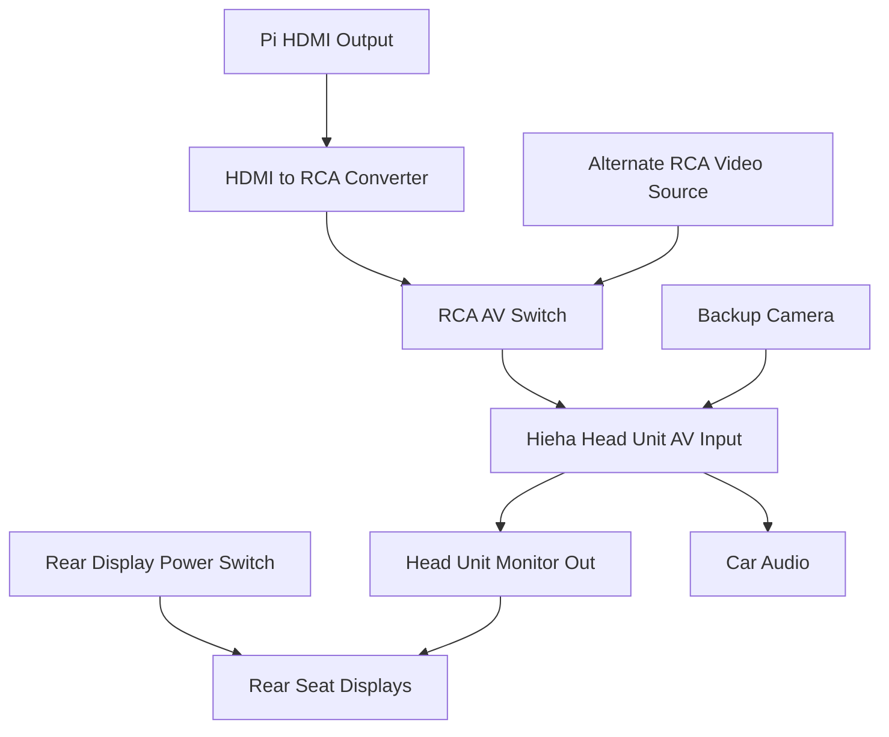

# 🎥 Video Routing & AV Setup

Routing plan for sending Raspberry Pi video output to the vehicle’s head unit and managing multiple AV inputs using an RCA switch.

---

## Components

- Raspberry Pi 3B+ (HDMI output)
- HDMI to RCA Converter
- RCA 3-Way AV Switch
- Hieha Head Unit with AV input
- Backup Camera (existing)
- Optional RCA secondary displays
- Vehicle 12V + Mini Switch

---

## Signal Flow Diagram

---

## Wiring Table

| Purpose                           | Connection           | From                        | To                           |
|-----------------------------------|----------------------|-----------------------------|------------------------------|
| Send Pi video signal              | HDMI                 | Raspberry Pi                | HDMI to RCA Converter        |
| Convert to RCA                    | RCA Video Out        | HDMI to RCA Converter       | RCA AV Switch (Input 1)      |
| Add alternate video source        | RCA Video Out        | Alternate Video Source      | RCA AV Switch (Input 2)      |
| Feed head unit display            | RCA Output           | RCA AV Switch Output        | Head Unit AV Input           |
| Feed rear display signal          | RCA Video Out        | Head Unit Monitor Output    | Rear Seat Displays           |
| Control rear display power        | 12V + Switch         | Vehicle 12V + Mini Switch   | Rear Display Power Input     |

---

## Behavior

- The Raspberry Pi's HDMI output is converted to RCA and routed through a manual RCA switch.
- The RCA switch selects between the Pi and an alternate video source.
- The selected signal is routed to the head unit AV input.
- The head unit outputs audio to the speakers and mirrors video to its "Monitor Out" RCA port.
- Rear seat displays are powered by a switched 12V line:
  - When the rocker switch is ON, the displays receive power and show the mirrored signal.
  - When the switch is OFF, the displays are powered down completely regardless of signal.

---

## Notes

- The RCA switch is manually toggled — consider mounting accessibly in dash or console.
- The HDMI to RCA converter requires 5V USB power (can be shared with Pi power if needed).
- Audio from the Pi is passed through HDMI and extracted by the converter to RCA L/R.

---

## 🔗 Parts List

| Part | Description | Amazon Link |
|------|-------------|-------------|
| HDMI to RCA Converter | Converts Pi HDMI output to analog video/audio | [View on Amazon](https://www.amazon.com/dp/B082X97KKW?ref=ppx_yo2ov_dt_b_fed_asin_title) |
| RCA 3-Way AV Switch | Manually toggles between multiple RCA sources | [View on Amazon](https://www.amazon.com/dp/B0DM58HDYQ?ref=ppx_yo2ov_dt_b_fed_asin_title) |
| USB + HDMI Dash Extension Panel | Allows clean HDMI/USB port access in vehicle dash | [View on Amazon](https://www.amazon.com/dp/B07T4VTT4T?ref_=ppx_hzsearch_conn_dt_b_fed_asin_title_3) |
| Hieha Head Unit | Main screen with AV input/output, handles video switching | [View on Amazon](https://www.amazon.com/dp/B08QMZ4TGF?ref=ppx_yo2ov_dt_b_fed_asin_title) |
